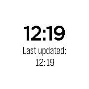

# health-steps-remote



Basic app that can send steps data to a remote server. Default behavior is to
upload the last 15 minutes worth of minute data after that interval, but can be
configured in `src/config.h`. On first launch, the most recent data available is
sent immediately, with subsequent launches checking that the interval has
elapsed before sending data.


## How to use

1. Set the server URL (minus `http://`) using `NODE_SERVER_URL` in 
   `src/js/pebble-js-app.js`.

2. Build the app and install the `.pbw` file.

3. Run the Node server:

    ```
    $ cd server
    $ node app.js
    ```

4. Keep the phone connected. When step data arrives, the server will print it
   out by default:

    ```
    Got data: 0,0,0,0,0,0,0,0,0,0,0,0,144,10,0 (15 items)
    ```
